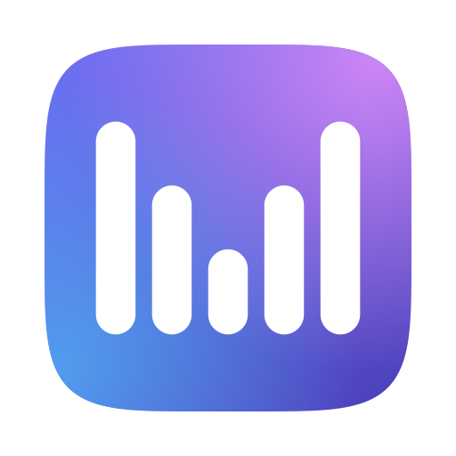

# Murmur

Hold a key, speak, release, and the sentence appears in whatever text field had
focus. Menu bar only, fully on-device, no API keys and no per-minute cost.

## Status

All six phases are implemented: global hold/release hotkey, microphone capture,
streaming on-device recognition with a live partial transcript, atomic insertion
into the previously focused application, local AI cleanup at three strengths,
and a settings window covering hotkey, cleanup, custom vocabulary, and models.

## Requirements

macOS 26 (Tahoe) on Apple Silicon.

Command Line Tools alone are enough for the built-in Apple engines and the
Core ML speech models. The downloadable **language** models additionally need
full Xcode plus the Metal toolchain, because MLX compiles Metal kernels at build
time:

```sh
xcodebuild -downloadComponent MetalToolchain   # after installing Xcode
```

## Build and run

```sh
./scripts/build-app.sh          # debug
./scripts/build-app.sh release  # release
open build/Murmur.app
```

Murmur has no Dock icon. Look for the microphone glyph in the menu bar.

### Before first use

Set **System Settings › Keyboard › Press 🌐 key to → Do Nothing**. By default
macOS gives the Fn/Globe key its own behaviour (emoji picker or input-source
switching), which will fight Murmur and steal focus. If you would rather leave
the Globe key alone, pick a different trigger from the menu bar under
**Hold-to-Talk Key** — Right Option is the least contested alternative.

### The microphone indicator

Murmur holds the input device open while it is running, so that pressing the
dictation key only switches where the audio goes rather than opening a device —
which measured up to half a second, all of it taken off the front of what you
said. macOS shows the orange microphone indicator for as long as the device is
open. Nothing is transcribed, inserted or written to disk unless you start a
dictation; while idle the audio is kept for 0.3 s so a word begun just before
the key is not lost, and is then discarded.

Turn it off from the menu bar under **Keep Microphone Open**, or in
**Settings › Hotkey**, if you would rather have the indicator only while
dictating — at the cost of the first fraction of a second of each utterance.

macOS keeps the orange indicator lit for a few seconds after any app releases
the microphone, so switching this off and watching the menu bar looks like
nothing happened. The line under the menu item reads the real state from
CoreAudio and says **Microphone: open** or **Microphone: closed**.

### Models

Nothing is bundled. Everything not built into macOS is downloaded only when you
ask for it, and the first download is the only step needing a network.

| Layer | Model | Size | Runtime | Punctuates |
| --- | --- | --- | --- | --- |
| Speech | Apple SpeechAnalyzer | built in | macOS | yes |
| Speech | NVIDIA Parakeet Realtime EOU 120M | ~250 MB | Core ML | **no** |
| Speech | NVIDIA Nemotron Streaming 0.6B (English) | ~1.2 GB | Core ML | yes |
| Speech | Moonshine Small Streaming | ~400 MB | Moonshine C++ | yes |
| Speech | Moonshine Medium Streaming | ~1.1 GB | Moonshine C++ | yes |
| Speech | NVIDIA Parakeet TDT 0.6B v2 | ~452 MB | Core ML | yes |
| Speech | OpenAI Whisper Tiny / Base (English) | ~153 MB / ~146 MB | Core ML | yes |
| Speech | OpenAI Whisper Small / Medium (English) | ~487 MB / ~1.5 GB | Core ML | yes |
| Speech | OpenAI Whisper Large v3 Turbo | ~1.6 GB | Core ML | yes |
| Cleanup | Apple Foundation Model | built in | macOS | — |
| Cleanup | Qwen3 4B / 1.7B | ~2.3 GB / ~1.0 GB | MLX | — |
| Cleanup | Gemma 3 4B / 1B | ~2.5 GB / ~700 MB | MLX | — |

Each speech model declares whether it produces text live while you speak, and a
test enforces that the claim matches the engine behind it — a model wrongly
marked live would show an empty overlay for the whole hold. Parakeet TDT and
every Whisper decode on release instead, so nothing appears until you let go.

Parakeet EOU emits lowercase text with no punctuation, so it needs AI cleanup
switched on to be readable. Moonshine's English models are MIT licensed; its
other languages are non-commercial, so Murmur only offers English. Whisper is
offered as OpenAI's English-only checkpoints, except Large v3 Turbo, which has
no English release and is pinned to English instead.

Apple's cleanup model is the best of the cleanup options as well as the
fastest — the MLX models are there for when Apple Intelligence is unavailable.

### Commands

```sh
./.build/debug/MurmurApp --diagnose            # permissions, models, audio formats
./.build/debug/MurmurApp --selftest [modelID]  # drives a real recognizer end to end
./.build/debug/MurmurApp --testcleanup         # cleanup at all three strengths
./.build/debug/MurmurApp --testhomophones      # "cloud" vs "Claude" disambiguation
./.build/debug/MurmurApp --download [modelID]  # fetch a model; omit id to list
swift run MurmurTests                          # unit tests
```

`--selftest` renders sentences with `say`, streams them through the live
recognizer, and checks the text that comes out. It fails only on assembly
corruption; a misheard word from synthesized speech is reported but tolerated.

## How the app is built

Two build systems, for a reason that is not obvious:

* **SwiftPM builds the app.** `xcodebuild` cannot: FluidAudio's
  `NemoTextProcessing.xcframework` and Moonshine's `Moonshine.xcframework` both
  emit `include/module.modulemap`, and Xcode rejects the collision.
* **xcodebuild builds the MLX Metal library.** SwiftPM cannot compile `.metal`
  sources, so an MLX binary built by SwiftPM dies at runtime with "Failed to
  load the default metallib".

`tools/MetallibBuilder` exists solely to produce `mlx-swift_Cmlx.bundle`, which
`scripts/build-app.sh` copies into the app. It is cached between builds.

## Architecture

```
microphone → AudioCapture → SpeechRecognitionEngine → TranscriptBuffer
                                                          ↓
                          TextInserting ← TranscriptCleaner (optional)
```

| Piece | File | Role |
| --- | --- | --- |
| Hotkey | `Sources/MurmurApp/HotkeyMonitor.swift` | Hold/release, no toggling |
| Capture | `Sources/MurmurCore/AudioCapture.swift` | Opens the mic only while held |
| Recognition | `Sources/MurmurCore/AppleSpeechEngine.swift` | Apple `SpeechAnalyzer` |
| Assembly | `Sources/MurmurCore/TranscriptBuffer.swift` | Merges partial and final results |
| Spacing | `Sources/MurmurCore/TextNormalizer.swift` | Punctuation-safe joining |
| Insertion | `Sources/MurmurCore/TextInserter.swift` | Atomic paste, clipboard restored |
| Overlay | `Sources/MurmurApp/OverlayPanel.swift` | Non-activating floating panel |

### Why the speech engine is Apple's

`SpeechAnalyzer` / `SpeechTranscriber`, new in macOS 26, is on-device,
free, Apple-Silicon-optimized, and genuinely streaming — it reports *volatile*
results while you speak and finalizes them as it becomes confident. It carries
no third-party dependency, and the OS manages the model. `modelRetention:
.processLifetime` keeps the model resident between dictations, and
`SpeechModels.endRetention()` backs the menu bar's "Unload Models" item.

Swapping engines means writing one more conformance to
`SpeechRecognitionEngine` and changing the default in `DictationController`.
Nothing else moves. [FluidAudio](https://github.com/FluidInference/FluidAudio)
(Parakeet TDT v3 via Core ML) is the natural second implementation and would
also lower the floor to macOS 13.

### Why text cannot be corrupted

Other dictation apps produce `act ually` and `feature .` because they type the
transcript keystroke by keystroke, or splice revised partial results into text
already delivered. Murmur does neither:

- Partial results are shown **only** in the overlay. Nothing speculative ever
  reaches your application.
- The final transcript crosses into the target app as **one** pasteboard value
  and one Command-V, so it cannot arrive in fragments.
- `TextNormalizer` may insert a space only at a boundary *between* two
  recognizer chunks, and `finalize` only ever *removes* whitespace. No rule can
  put a space inside a word or a decimal number.

`swift run MurmurTests` covers this directly, including a test that streams
every reference sentence one word at a time and at every whitespace split point
and requires byte-exact reconstruction.

## Custom vocabulary

Settings › Words holds names and terms that matter to you. Each one is applied
at three points, because no single mechanism is sufficient:

1. **Recognition bias** — terms are passed to `AnalysisContext`, making the
   recognizer likelier to hear "Claude" rather than "cloud" in the first place.
2. **Context-aware repair** — the cleanup model is told which words are confused
   for which, and decides from the surrounding sentence. "I asked cloud to
   review my code" becomes Claude; "I stored the file in the cloud" does not.
3. **Deterministic spelling** — canonical casing is enforced last, after
   cleanup, so neither model can undo it. "vscode" becomes "VS Code".

Blind find-and-replace is deliberately opt-in per term, and the UI warns that it
will rewrite ordinary uses of the everyday word.

## Permissions

| Permission | Why |
| --- | --- |
| Microphone | Capture speech. Opened only while the key is held. |
| Accessibility | See the hotkey while another app is frontmost, and post the paste keystroke into it. |

Input Monitoring is deliberately **not** requested. `NSEvent` global monitors
cover the hotkey without it.

## Troubleshooting

**Murmur is missing from Privacy & Security › Microphone.** It is signed with
the hardened runtime, which denies the microphone outright — without ever
prompting, and without listing the app — unless
`com.apple.security.device.audio-input` is present in `Murmur.entitlements`.
Rebuild with `./scripts/build-app.sh`, then
`tccutil reset Microphone com.sikaihuang.murmur` and relaunch.

**The app launches but nothing happens.** Check `~/Library/Logs/Murmur.log`,
which is rewritten on every launch. A healthy start looks like:

```
applicationDidFinishLaunching
status item created
bootstrap started
requesting microphone access
microphone granted=true
accessibility trusted=true
hotkey monitor started
warmUp finished, status=idle
```

If the log is empty or stops before `applicationDidFinishLaunching`, the main
thread is not owned by AppKit. `main.swift` must stay synchronous: a top-level
`await` hands the main thread to the concurrency runtime, and an app started by
LaunchServices then never receives `applicationDidFinishLaunching`. Running the
binary straight from a terminal hides this, because there is no launch event to
wait for.

## Notes

- A press shorter than 250 ms is treated as an incidental tap and inserts
  nothing, so brushing Fn never pastes.
- The overlay is a non-activating `NSPanel` and the app is an accessory, so
  focus never moves and your text field keeps the caret.
- Your clipboard is captured before the paste and restored ~350 ms later, and
  the restore is skipped if you copied something in the meantime.
- Debug builds print a latency breakdown after every dictation.
